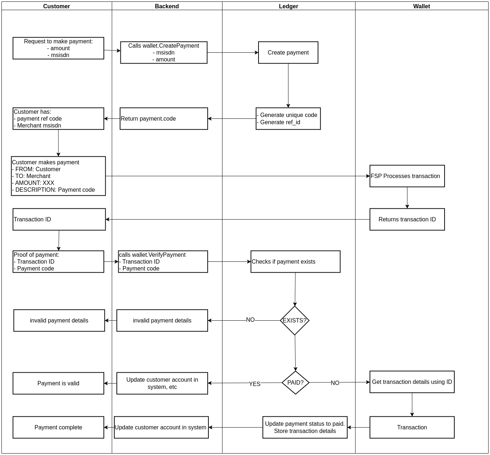

# go-payup

Simple and crude library to facilitate in handling MNO mobile wallet payments for backend systems.

### How it works/supposed to work

### Extending go-payup

Extending go-payup is easy. Grab any `MobileWallet` or `Ledger` implementation and register it through `gopayup.RegisterLedger(string,LedgerOpener)` or `gopayup.RegisterWallet(string,WalletResolver)`.

Finally, anyone can then call `gopayup.NewLedger(string)` or `gopayup.MobileWallet(string)`

### Instantiation

To create instances of wallets and ledgers through `gopayup.NewLedger` or `gopayup.NewMobileWallet`, you must pass a DSN (Data Source Name) string containing the necessary paremeters, i.e client secret, client keys, or database connection details in case of a ledger.
